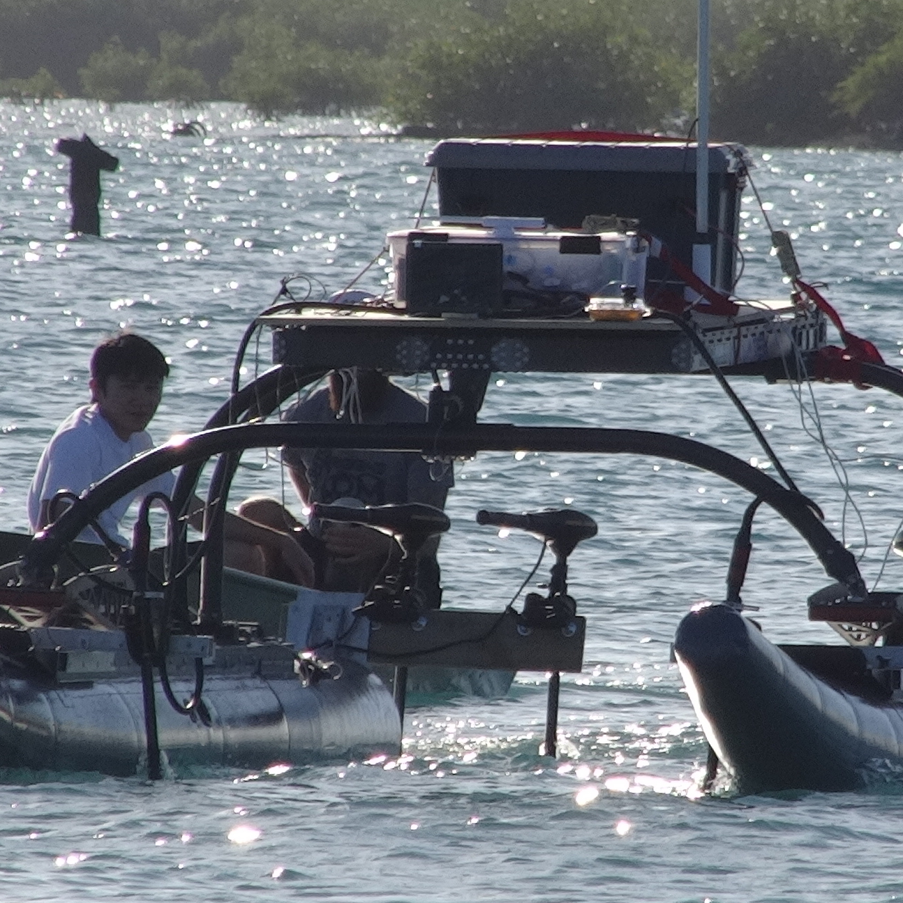

During summer of '16, Team Kanaloa was formed at the University of Hawaii at Manoa under the direction of Dr. Zachary Trimble. The goal of Team Kanaloa was to design, build, and program an unmanned water surface vessel in order to complete naval tasks within the semi-annual Maritime RobotX Challenge. The project required a wide variety of skills to develop the various subsystems that made up our autonomous vessel.

My role within this project was as a computing sub-team member. I used Robot Operating System (ROS) to integrate LiDAR and GPS data to populate a 2D occupancy grid, used for object detection, pathplanning, and localization. I also implemented an Astar pathplanning algorithm to plot a path from current location to a given goal coordinate within our occupancy grid. In addition, I wrote the top-level launch files for ROS to initialize various ROS nodes and scripts.
